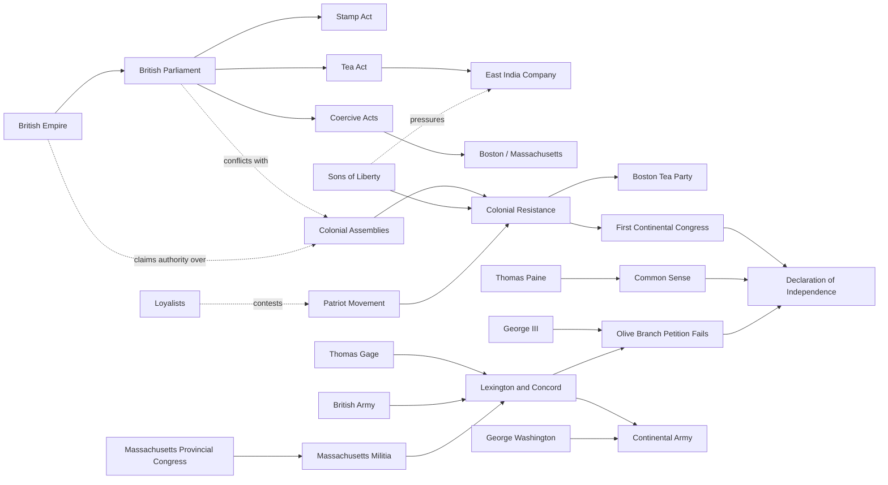

# American Revolution Actor Map

## Reading the Map
- Parliament is the legal mechanism for imperial policy.
- The East India Company is a commercial actor whose crisis became political through the Tea Act.
- Colonial assemblies, resistance networks, and Congress represent escalating forms of colonial coordination.
- The Patriot movement is an umbrella note, not a single institution.

## Sources
- [[Source - LOC Journals of the Continental Congress]]
- [[Source - UK National Archives Boston Tea Party]]
- [[Source - Avalon Boston Committee Circular Letter 1774]]
- [[Source - NPS Washington Appointment Commander in Chief]]
- [[Source - NPS Rebellion Minute Man]]
