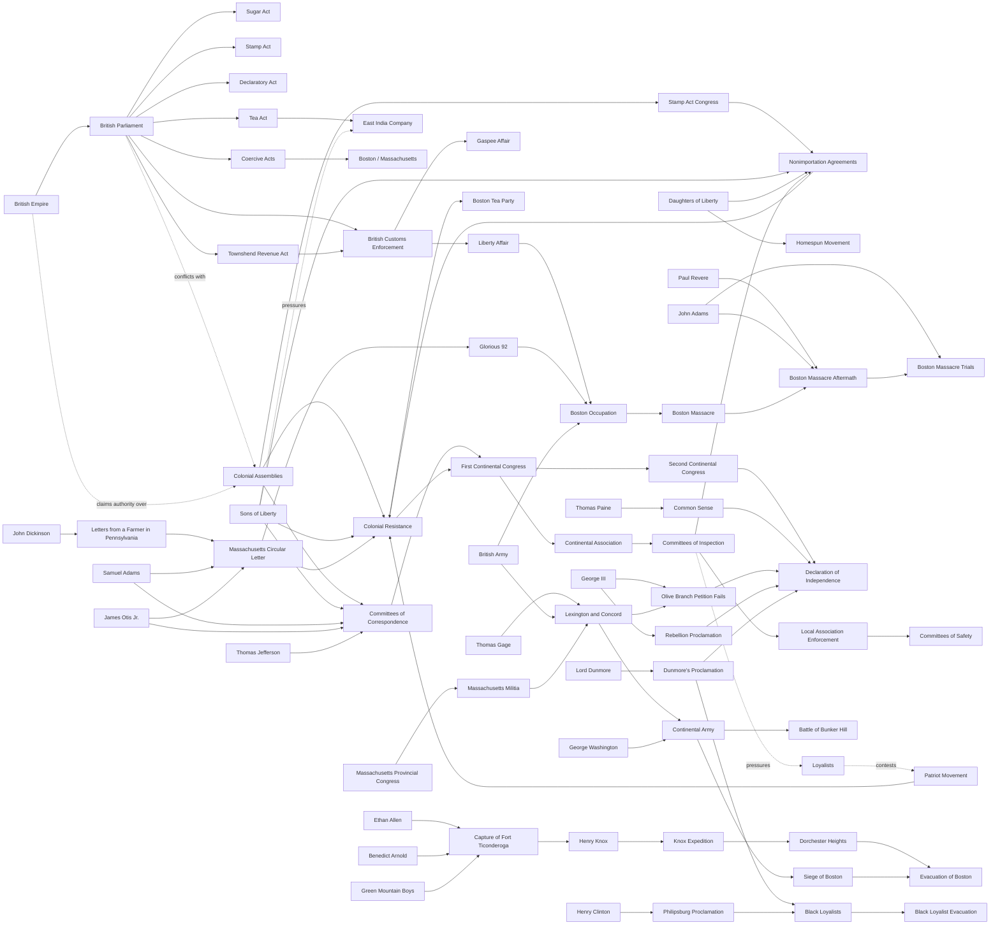

# American Revolution Actor Map

## Reading the Map
- Parliament is the legal mechanism for imperial policy.
- The Townshend Revenue Act links Parliament directly to customs enforcement and colonial assembly resistance.
- The East India Company is a commercial actor whose crisis became political through the Tea Act.
- Colonial assemblies, resistance networks, and Congress represent escalating forms of colonial coordination.
- Nonimportation, homespun, and circular-letter politics show resistance infrastructure before the First Continental Congress.
- The occupation path shows British customs and army presence creating a military-public-opinion crisis in Boston.
- The John Adams path separates the courtroom defense and verdicts from the broader Patriot and Loyalist media battle.
- The committees path shows information networks becoming Association enforcement through local inspection committees.
- Local enforcement links boycott practice to committees of safety and militia-adjacent governance.
- Black Loyalists show enslaved people's freedom seeking inside British military strategy and Loyalist evacuation.
- The Patriot movement is an umbrella note, not a single institution.

## Sources
- [[Source - LOC Journals of the Continental Congress]]
- [[Source - UK National Archives Boston Tea Party]]
- [[Source - Avalon Boston Committee Circular Letter 1774]]
- [[Source - Avalon Massachusetts Circular Letter 1768]]
- [[Source - MHS Boston Pamphlet 1772]]
- [[Source - Avalon Virginia Committee Resolutions 1773]]
- [[Source - Founders Online Continental Association 1774]]
- [[Source - Founders Online Braintree Association 1775]]
- [[Source - NCpedia Committees of Safety Primary Source]]
- [[Source - LOC True Sons Non-Importation Broadside]]
- [[Source - Colonial Williamsburg Sons and Daughters of Liberty]]
- [[Source - Commonwealth Museum Customs Commissioners and Liberty]]
- [[Source - Commonwealth Museum Weight of Occupation]]
- [[Source - LOC Revere Bloody Massacre Engraving]]
- [[Source - MHS Adams Argument Wemms Trial]]
- [[Source - MHS Wemms Trial Verdicts]]
- [[Source - Rhode Island Historical Society Burning of the Gaspee]]
- [[Source - NPS Washington Appointment Commander in Chief]]
- [[Source - NPS Rebellion Minute Man]]
- [[Source - LOC Philipsburg Proclamation]]
- [[Source - LAC Book of Negroes 1783]]
- [[Source - Avalon Townshend Revenue Act 1767]]
