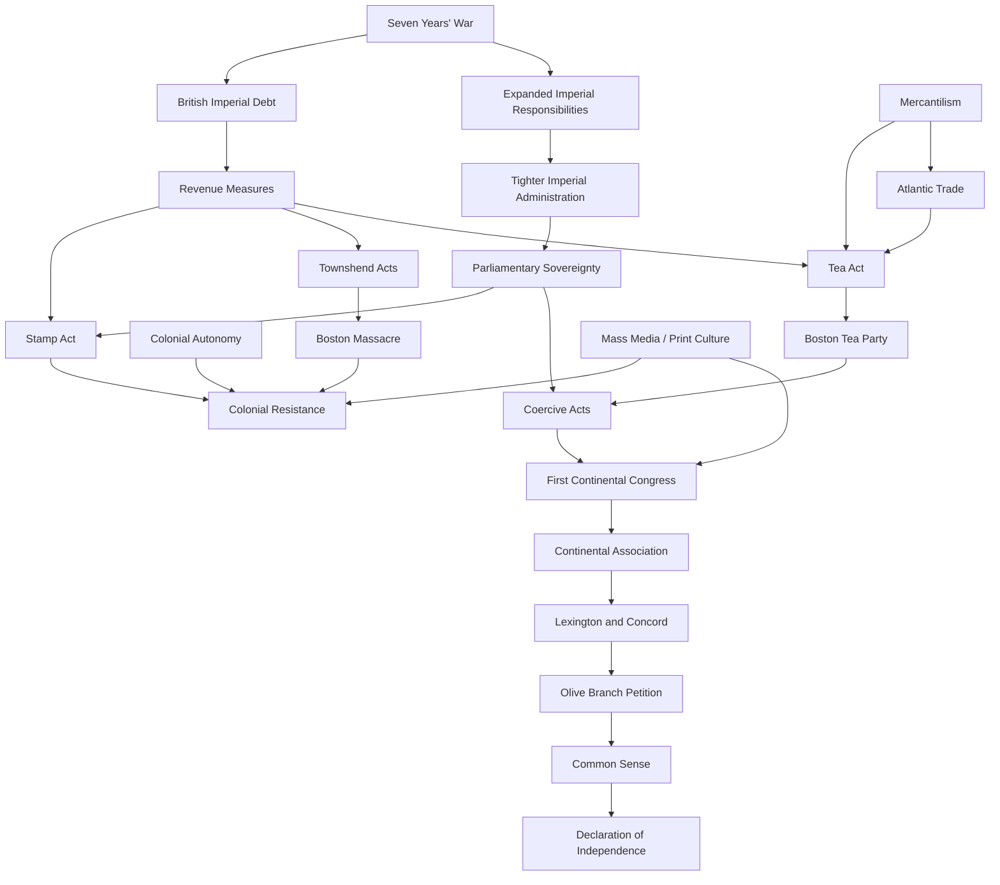

# American Revolution Pressure Map

## Reading the Map
- The debt path shows how war finance became revenue policy.
- The sovereignty path shows how Parliament's authority claim made taxes and punishment constitutional issues.
- The autonomy path shows why colonists interpreted policies as threats to local self-government.
- The trade path shows why tea became more than a commodity: it carried taxation, monopoly, and imperial authority.

## Current Confidence
Medium. The broad causal relationships are supported by institutional sources, but specific arrows need deeper primary-source and scholarly comparison.

## Sources
- [[Source - LOC British Reforms and Colonial Resistance 1763-1766]]
- [[Source - UK National Archives Causes of the American Revolution]]
- [[Source - American Battlefield Trust Tea Act 1773]]
- [[Source - Avalon Boston Port Act 1774]]
