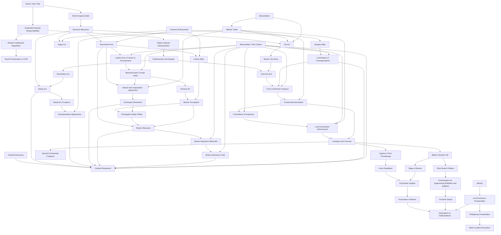

# American Revolution Pressure Map

## Reading the Map
- The debt path shows how war finance became revenue policy.
- The sovereignty path shows how Parliament's authority claim made taxes and punishment constitutional issues.
- The autonomy path shows why colonists interpreted policies as threats to local self-government.
- The trade path shows why tea became more than a commodity: it carried taxation, monopoly, and imperial authority.
- The nonimportation path shows how trade and household consumption became political pressure systems before armed conflict.
- The occupation path shows how customs enforcement and assembly defiance became a daily military presence before the Boston Massacre.
- The trial path shows how the Massacre became courtroom testimony, verdict, and rule-of-law legitimacy as well as propaganda.
- The slavery-war path shows how British freedom policies and Black Loyalist evacuation exposed the limits of Patriot liberty claims.
- The committee path shows how correspondence and inspection converted information sharing into enforceable continental and local pressure.

## Current Confidence
Medium. The broad causal relationships are supported by institutional sources, but specific arrows need deeper primary-source and scholarly comparison.

## Sources
- [[Source - LOC British Reforms and Colonial Resistance 1763-1766]]
- [[Source - UK National Archives Causes of the American Revolution]]
- [[Source - Avalon Sugar Act 1764]]
- [[Source - Avalon Stamp Act Congress Resolutions 1765]]
- [[Source - Constitution Center Letters from a Farmer]]
- [[Source - Avalon Massachusetts Circular Letter 1768]]
- [[Source - ABT Boston Non-Importation Agreement]]
- [[Source - Commonwealth Museum Glorious 92]]
- [[Source - Commonwealth Museum Customs Commissioners and Liberty]]
- [[Source - Commonwealth Museum Occupation Landing]]
- [[Source - Commonwealth Museum Weight of Occupation]]
- [[Source - MHS Fair Account Boston Massacre]]
- [[Source - LOC Wemms Trial Transcript]]
- [[Source - MHS Wemms Trial Verdicts]]
- [[Source - Rhode Island Historical Society Burning of the Gaspee]]
- [[Source - MHS Boston Pamphlet 1772]]
- [[Source - Avalon Virginia Committee Resolutions 1773]]
- [[Source - American Battlefield Trust Tea Act 1773]]
- [[Source - Avalon Boston Port Act 1774]]
- [[Source - Founders Online Continental Association 1774]]
- [[Source - Founders Online Braintree Association 1775]]
- [[Source - NCpedia Committees of Safety Primary Source]]
- [[Source - NPS Siege of Boston Overview]]
- [[Source - LOC Philipsburg Proclamation]]
- [[Source - LAC Book of Negroes 1783]]
