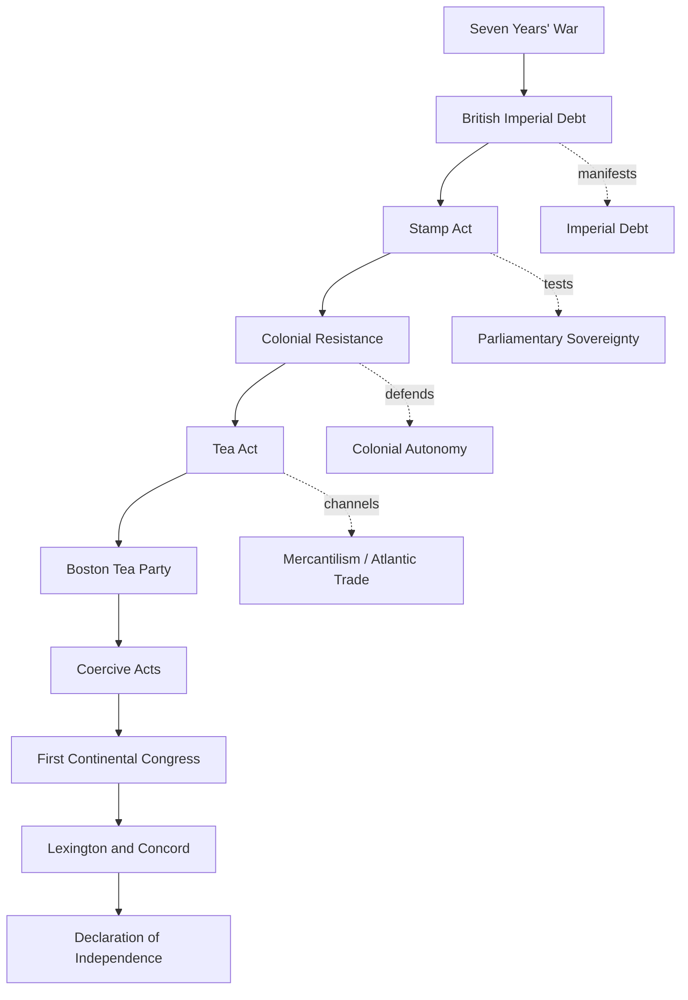

# American Revolution Causal Chain Map

## Map Notes
- This is now a first-pass researched scaffold, not a final causal proof.
- Strongest supported links so far: Seven Years' War -> British Imperial Debt -> Stamp Act; Tea Act -> Boston Tea Party -> Coercive Acts; Coercive Acts -> First Continental Congress.
- Lexington and Concord remains source-backed as the transition into armed conflict, but the exact first-shot question is intentionally left unresolved.
- Future passes should qualify direct, indirect, and disputed relationships with more specific primary sources.
