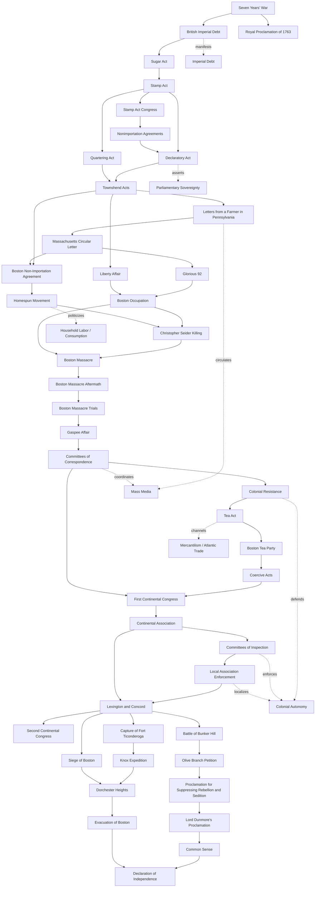

# American Revolution Causal Chain Map

## Map Notes
- This is now a first-pass researched scaffold, not a final causal proof.
- Strongest supported links so far: Seven Years' War -> British Imperial Debt -> Sugar Act/Stamp Act; Stamp Act -> Stamp Act Congress/nonimportation; Stamp Act -> Declaratory Act -> Townshend Acts as a sovereignty sequence; Townshend Acts -> Farmer letters/Circular Letter/nonimportation; Circular Letter/Liberty Affair -> occupation; occupation -> Boston Massacre -> aftermath/trials; Gaspee/committee networks -> First Continental Congress; Tea Act -> Boston Tea Party -> Coercive Acts; Coercive Acts -> First Continental Congress -> Continental Association -> local enforcement.
- Lexington and Concord remains source-backed as the transition into armed conflict, but the exact first-shot question is intentionally left unresolved.
- Future passes should qualify direct, indirect, and disputed relationships with more specific primary sources.
