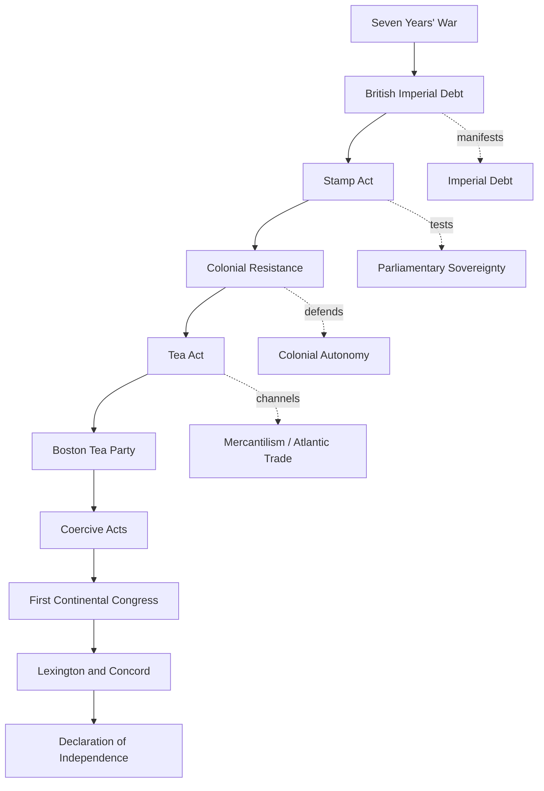

# American Revolution Causal Chain Map

## Map Notes
- This is a scaffold, not a researched causal proof.
- Replace or qualify arrows as source work clarifies direct, indirect, and disputed relationships.
